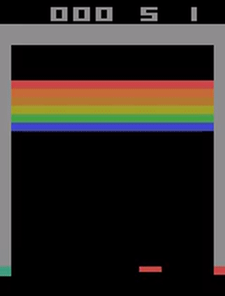

# DQN-Atari
Tensorflow implementation (both tf1 and tf2) of Deep Q Network for Atari Video Games.

This work is the reproduction of hugely popular nature paper [Human-level control through deep reinforcement learning](https://storage.googleapis.com/deepmind-media/dqn/DQNNaturePaper.pdf). This paper is one of the major breakthroughs in the field of Deep Reinforcement Learning and it succeeded in applying Q learning to the challenging domain of atari games. In this repo I tried to reproduce the DQN algorithm introduced in the paper and successfully trained it on atari games like Breakout. Contrary to evaluation proposed in paper more fair and robust evaluation of DQN agents is done by evaluating in stochastic environments.

# Algorithm

# Usage

All configuration parameters and hyperparameters for DQN algorithm used for this work can be found in config.py.

For training DQN algorithm in tensorflow1 run 
`python main.py --train --env '<gym-atari-env>'`

For training in tensorflow2 run
`python main_tf2.py --train --env '<gym-atari-env>'`

For evaluation and playing one episode replace --train flag with --evaluate and --play falgs respectively

# Training and Eval Plots
Arcade learning environments or atari games are inherently not stochastic and they behave in a deterministic manner. To fairly evaluate DQN agents stochasticity should be introduced into these environments. Refer to this paper for more detailed explanation.

[Revisiting the Arcade Learning Environment:Evaluation Protocols and Open Problems for General Agents](https://arxiv.org/pdf/1709.06009.pdf)

To account for fair evaluation DeepMind scholars introduced random No-op(do-nothing action) resets before each episode (gym atari NoFrameSkip-v4 envs) but the paper mentioned above argues that more robut stochasticity need to be introduced into ALE envs and they propose repeat action probability i.e an action is repeated with this probabilty for the next frames in the Atari games(gym atari NoFrameskip-v0 envs). 

This repo evaluates DQN agent on both Breakout-NoFrameSkip-v4 (deterministic) and Breakout-NoFrameSkip-v0 (stochastic) envs. We use NoFrameSkip envs as we skip frames within our pipeline of DQN agent.

# Results

